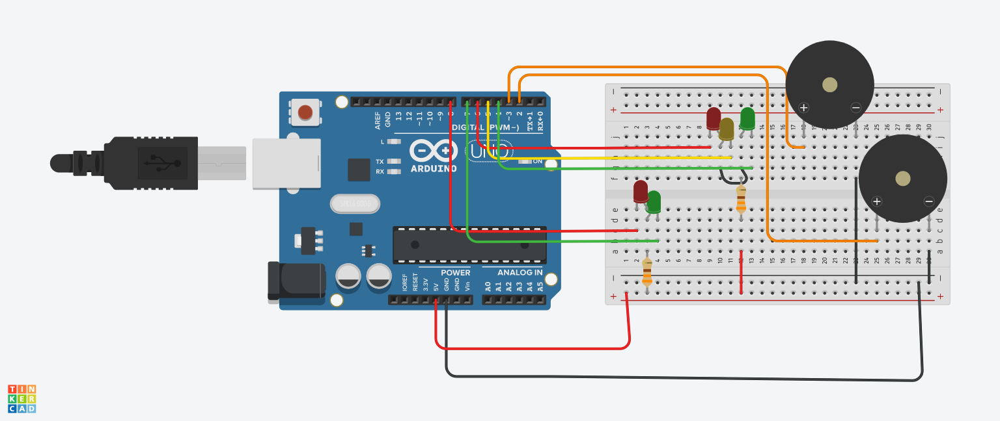

# SMART TRAFFIC LIGHT

A apresentacao do projeto pode ser encontrada aqui --> <a href="">Smart traffic light</a>

<b>Realizado por: Arthur Trarbach Sampaio, Jordano Furtado de Souza, Nathan Garcia Freitas</b>
 Universidade Federal do Espírito Santo (UFES) - Engenharia da Computação
 Projeto Integrado em Computação - PIC - 2022/2

## Resumo

O projeto consiste basicamente em um sistema de semáforos para uma pista de mão única que detecta a presença de pedestres e a intensidade do tráfego, utilizando estas informações para abrir ou fechar o semáforo.

## Descrição 

O projeto utiliza de um arduino para o controle do semáforo e detecção de carros e pedestres, que é feita por meio do uso de placas de pressão. A ideia principal do projeto é evitar o acúmulo de carros causado por semáforos fechados desnecessários, além de reduzir o tempo médio de espera por pedestre.

## Componentes:
- Arduino UNO
- 2 Placas de pressão
- 2 LEDs Vermelhos
- 2 LEDs Verdes
- 1 LED Amarelo
- 2 Resistores de 330Ω
- Jumpers

## Esquemático

<i>Os piezômetros utilizados no esquemático, na realidade, representam as placas de pressão que foram utilizadas.</i>
